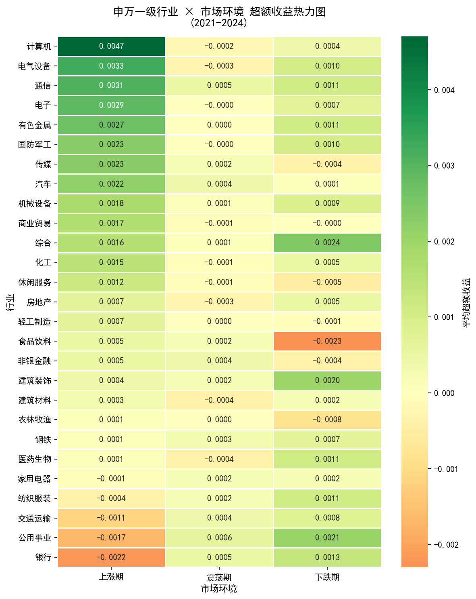

# A股申万行业轮动规律分析（2021-2024）

> 📚 **项目性质说明**
> 本项目的代码与分析框架由 AI 协助构建,作为我学习量化数据分析流程的实践材料。
> 我是金融工程专业大二学生,正在系统学习行业轮动、超额收益、市场环境分类等量化分析概念,
> 以及 Pandas、Seaborn 等数据分析工具。
>
> 当前仓库展示的是项目的**完整流程与结论**;每一步背后的原理与代码逻辑,
> 我正在逐步深入理解,学习笔记会以下方"我的理解笔记"板块持续补充。

## 这个项目在做什么

A 股不同行业在牛市、熊市、震荡市中表现差异显著。本项目基于申万一级行业指数,
量化分析 27 个行业在 2021-2024 年不同市场环境下的超额收益规律,
试图回答一个具体问题:**在不同的市场环境下,该买哪类行业、避开哪类行业?**



## 核心结论

### 1. 成长类:上涨期弹性最大,但回撤同样放大
计算机、电气设备、电子在上涨期日均超额收益分别为 +0.47%、+0.33%、+0.29%,
胜率达 61%、60%、59%。但下跌期超额收益转负,β 值高、涨跌均放大,
适合趋势明确的上涨期持有。

### 2. 银行是最纯粹的防御行业
银行上涨期胜率仅 0.39(27 个行业最低),下跌期胜率 0.60(最高),
与市场走势呈明显负相关。2021-2024 累计收益虽跑输大盘,
但在 2022 年熊市中相对抗跌,具备典型防御配置价值。

### 3. 反常识发现:消费类并非天然防御
食品饮料下跌期日均超额收益 -0.23%、胜率仅 0.40,
是下跌期表现最差的行业之一。这与"消费=防御"的传统认知相悖。
原因可能在于 2021 年白酒高估值叠加消费降级预期,
估值杀跌主导了行情,基本面逻辑让位于资金面逻辑。

### 4. 周期类胜在持续性而非弹性
化工在上涨期胜率 0.64(最高),但单日超额收益中位数低于成长类。
2021 年碳中和行情驱动周期类累计涨幅一度超 40%,
随后随大宗商品周期回落震荡下行。

## 方法论

| 项目 | 定义 |
| --- | --- |
| 数据来源 | AkShare,申万一级行业指数日线 |
| 时间范围 | 2021-01 至 2024-12 |
| 市场环境 | 沪深 300 的 20 日滚动收益:>5% 上涨期 / <-5% 下跌期 / 其余震荡期 |
| 超额收益 | 行业日涨跌幅 - 沪深 300 日涨跌幅 |
| 样本分布 | 上涨期 95 日 / 震荡期 709 日 / 下跌期 134 日 |

## 项目结构
```

a-stock-industry-rotation/
├── notebooks/
│   ├── 01_data_fetch.ipynb      # 数据获取、清洗、指标计算
│   └── 02_conclusion.ipynb      # 业务结论与分析解读
├── data/
│   ├── raw/sw_industry_daily.csv    # 原始行业指数数据
│   ├── df_merged.csv                # 含市场环境标签的分析数据
│   ├── df_alpha.csv                 # 行业 × 环境超额收益汇总
│   ├── heatmap_alpha.png            # 超额收益热力图
│   ├── heatmap_winrate.png          # 胜率热力图
│   └── cumreturn_groups.png         # 分组累计收益走势图
├── requirements.txt
└── README.md

```

## 复现步骤

```bash
# 1. 克隆仓库
git clone https://github.com/wnt0801/a-stock-industry-rotation.git
cd a-stock-industry-rotation

# 2. 安装依赖
pip install -r requirements.txt

# 3. 依次运行
notebooks/01_data_fetch.ipynb
notebooks/02_conclusion.ipynb
```

## 📖 我的理解笔记

> 这个板块用于记录我对每个分析步骤的理解过程,会随学习进度持续更新。
> 目前是占位状态,逐步填充中。

### 关于"超额收益"
- [ ] 待学习:为什么用算术收益而不是对数收益?
- [ ] 待学习:超额收益 vs 阿尔法,概念上的区别?

### 关于"市场环境分类"
- [ ] 待学习:为什么选 20 日滚动窗口?换 10 日 / 60 日会有什么变化?
- [ ] 待学习:±5% 这个阈值怎么定的?是否经过敏感性测试?

### 关于"胜率 vs 平均超额收益"
- [ ] 待学习:为什么两个指标都要看?哪个更能反映"行业适合在某环境配置"?

### 关于代码实现
- [ ] 待学习:`pct_change()` 与 `rolling()` 在做什么?边界值如何处理?
- [ ] 待学习:`groupby` + `agg` 的完整数据流是怎么走的?

## 可能的深入方向

> 以下是这个课题可以进一步展开的方向,作为我自己后续选择课题的参考清单,
> 不代表当前已实现内容。会根据学习进度选择性深入。

- **稳健性验证**:扩展时间范围至更长周期(如 2015 年至今),检验"消费类不防御"的结论是否仅是 2021-2024 的特殊现象
- **风险调整指标**:加入夏普比率、最大回撤、信息比率等,而不只是看绝对超额收益
- **行业自动分组**:用 K-means 或层次聚类对行业进行无监督分组,对比与"成长 / 周期 / 消费 / 防御"人工分类的差异
- **环境分类优化**:测试不同滚动窗口(10/20/60 日)与阈值(±3%/±5%/±8%)对结论的影响
- **拓展至个股层面**:从行业指数下沉到行业内龙头股,观察"行业β"和"个股α"的分离效应